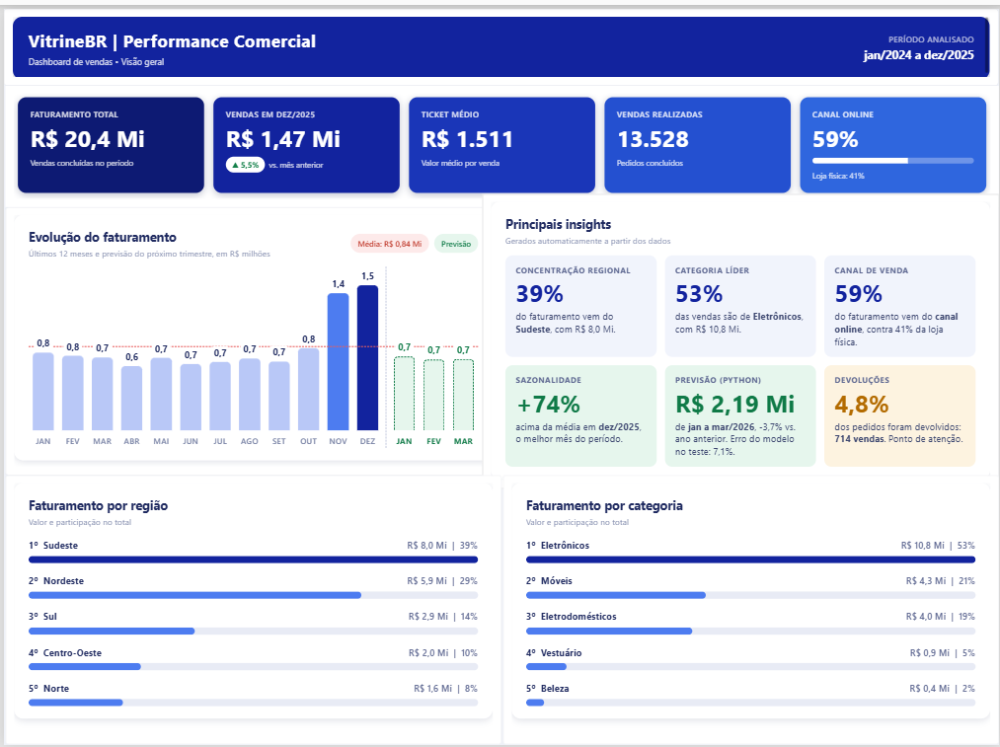
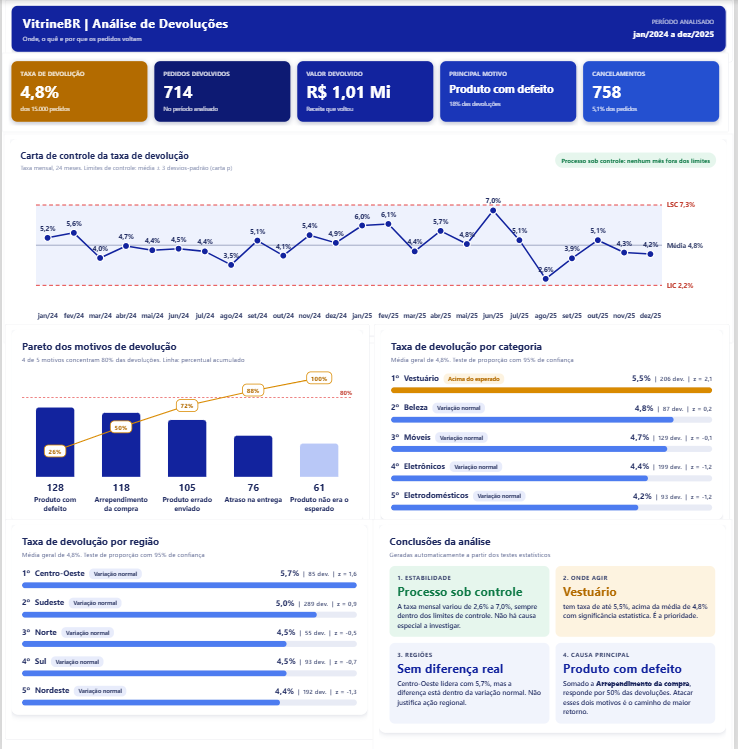

# VitrineBR | Dashboard de Vendas e Devoluções

Projeto de portfólio que simula as vendas de um varejo com canais online e loja física. O objetivo é mostrar o fluxo completo de análise: do banco de dados até o painel de indicadores, com previsão de vendas e análise estatística de devoluções.

## Página 1: Visão Geral

## Página 2: Análise de Devoluções

## Tecnologias

- **SQL Server**: banco de dados e consultas de análise
- **Power BI**: construção do dashboard
- **DAX**: medidas, inteligência de tempo, testes estatísticos e textos automáticos
- **HTML, CSS e SVG**: painéis e gráficos personalizados, gerados por medidas DAX e exibidos no visual HTML Content
- **Python** (pandas, pyodbc, scikit-learn): leitura do banco e previsão de vendas

## O que o dashboard responde

**Visão Geral**

- Qual o tamanho do negócio? Faturamento, ticket médio e volume de vendas
- Estamos crescendo? Evolução dos últimos 12 meses, com média e mês de pico
- O que esperar? Previsão do próximo trimestre
- Onde vendemos mais? Ranking por região e por categoria

**Devoluções**

- A taxa de devolução está estável? Carta de controle de 24 meses
- Por que os pedidos voltam? Pareto dos motivos
- As diferenças entre categorias e regiões são reais? Teste de proporção
- O que fazer? Conclusões geradas a partir dos testes

## Previsão de vendas

O script `02_previsao.py` lê o faturamento mensal direto do SQL Server, treina uma regressão linear com tendência e sazonalidade mensal, e grava a previsão dos três meses seguintes na tabela `previsao_vendas`, que o Power BI consome.

Para medir a qualidade do modelo, os três últimos meses da base foram escondidos no treino e depois comparados com a previsão:

| Mês | Real | Previsto | Erro |
| --- | --- | --- | --- |
| out/2025 | R$ 829.992 | R$ 666.841 | 19,7% |
| nov/2025 | R$ 1.389.673 | R$ 1.376.883 | 0,9% |
| dez/2025 | R$ 1.466.082 | R$ 1.476.411 | 0,7% |

Erro médio de 7,1%. O modelo acerta bem os meses de pico, que seguem um padrão sazonal claro, e erra mais em outubro de 2025, que ficou acima do padrão do ano anterior.

## Análise estatística das devoluções

Um ranking mostra quem está na frente, mas não diz se a diferença é real ou apenas variação aleatória. A página de devoluções usa três técnicas para separar uma coisa da outra.

| Técnica | Para que serve | Resultado |
| --- | --- | --- |
| Carta de controle (carta p) | Verificar se a taxa mensal está estável | Nenhum mês fora dos limites de controle |
| Pareto | Encontrar os motivos que concentram o problema | Os 2 principais motivos somam 50% das devoluções com motivo informado |
| Teste de proporção (z, 95%) | Checar se um grupo difere da média geral | Só Vestuário está acima da média com significância |

O ponto mais interessante: o Centro-Oeste lidera o ranking de regiões, com 5,7% contra 4,8% da média, mas tem poucos pedidos e a diferença não passa no teste. Sem estatística, a conclusão seria uma ação regional desnecessária. Com ela, a prioridade fica clara: a categoria Vestuário.

### Qualidade do dado

Das 714 devoluções, 488 têm motivo informado e 226 (32%) estão sem motivo registrado. Todos os percentuais por motivo usam as 488 como base, e o dashboard mostra a quantidade sem registro. Em um negócio real, essa lacuna seria o primeiro ponto a corrigir, porque limita qualquer análise de causa.

## Destaques técnicos

- Todos os painéis são medidas DAX que montam HTML dinamicamente
- Gráfico de linha e Pareto desenhados em SVG, dentro do Power BI
- Limites de controle e z-scores calculados em DAX
- Textos de insights e conclusões que se atualizam conforme os dados
- Integração Python, SQL Server e Power BI: o modelo grava no banco e o dashboard lê

## Arquivos

| Arquivo | Conteúdo |
| --- | --- |
| `medidas_dax.md` | Todas as medidas DAX das duas páginas |
| `01_ler_dados.py` | Leitura do faturamento mensal no SQL Server |
| `02_previsao.py` | Modelo de previsão, teste e gravação no banco |
| `dashboard_visao_geral.png` | Print da página Visão Geral |
| `dashboard_devolucoes.png` | Print da página Devoluções |

## Observação

Os dados são fictícios, criados apenas para fins de estudo. Os resultados ilustram o método, e não um negócio real.

## Autor

**Darlan Alves da Silva** 
Analista de Logística | Power BI, SQL, DAX e Python 
[LinkedIn](https://www.linkedin.com/in/darlan-alves-logistica-dados)
